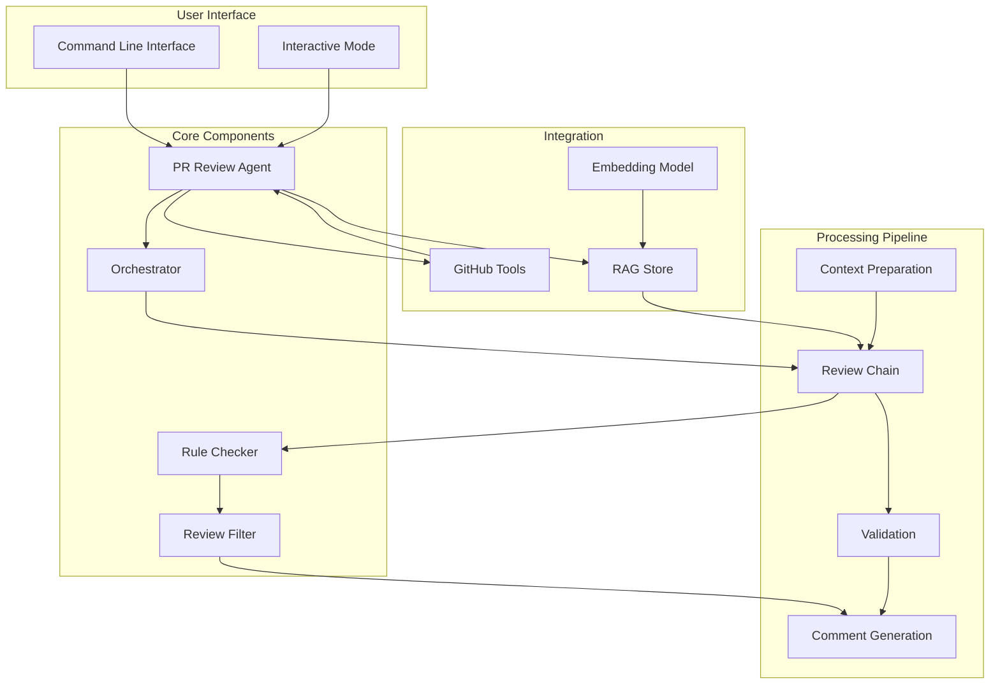

# Maestro

Maestro demonstrates how to build an intelligent code review assistant using DSPy-Go, implementing practical applications of LLM-powered agents for real-world software development workflows

## Overview

The Maestro example of using DSPy-Go to create an intelligent system that performs automated code reviews on GitHub pull requests. It showcases how to compose LLM capabilities with traditional software engineering practices to create useful developer tools. The system breaks down the complex task of code review into manageable steps, applies different types of analysis, and generates contextual feedback.


## Architecture Overview


## Core Features

The system leverages dspy-go's powerful orchestration to implement a multi-stage review process:

1. **Intelligent Context Analysis**: Prepares and structures code for effective LLM analysis, ensuring that models have the right context to make informed suggestions.

2. **Structured Review Pipeline**: Uses dspy-go's workflow capabilities to organize the review process into distinct stages:
   - Initial code analysis and issue detection
   - Validation of potential issues
   - Comment refinement and aggregation

3. **GitHub Integration**: Seamlessly integrates with GitHub's pull request workflow, making it easy to incorporate into existing development processes.

4. **Flexible Model Support**: Works with various LLM backends through dspy-go:
   - Local models via LLaMA.cpp and Ollama
   - Cloud services like Anthropic's Claude and Google's Gemini
   - Easy configuration for different model preferenc

## How Maestro Works

* Repository Indexing: Maestro first indexes your codebase, creating embeddings for code chunks to understand context.
* PR Analysis: When reviewing a PR, Maestro analyzes changed files and prepares them for review.
* Issue Detection: The RuleChecker module identifies potential issues based on a comprehensive taxonomy of review rules.
* Validation: The ReviewFilter ensures high precision by validating detected issues.
* Comment Generation: Structured, actionable feedback is generated with specific suggestions for improvement.

## Review Dimensions
Maestro evaluates code across four key dimensions:

* Code Defects: Error handling, logic flaws, resource management issues.
* Security Vulnerabilities: SQL injection, cross-site scripting, insecure data handling.
* Maintainability and Readability: Code organization, documentation, naming conventions.
* Performance Issues: Inefficient algorithms, suboptimal data structures, excessive operations.

## Getting started

### Prerequisites
- Go 1.22.5 or higher
- SQLite with sqlite-vec extension
- GitHub API access token
- One of the supported LLM backends

### Installation

1. Clone the repository:
```bash
git clone github.com/XiaoConstantine/maestro
```


2. Install dependencies:
```bash
go mod download

```

3. Set up your GitHub token:
```bash
export MAESTRO_GITHUB_TOKEN=your_github_token
```

### Usage

Maestro offers both interactive and command-line interfaces:

```bash
# Interactive mode with guided setup
maestro -i

# Direct CLI usage
maestro --owner=owner --repo=repository --pr=number # add -i to enter interactive mode

# Specify custom model
maestro --model="provider:model:config" --pr=number # add -i to enter interactive mode

```


### Configuration

#### Configuration Options
Maestro supports various configuration options:

* --github-token: GitHub personal access token (can also use MAESTRO_GITHUB_TOKEN environment variable)
* --owner: Repository owner
* --repo: Repository name
* --pr: Pull request number to review
* --model: Select which LLM to use (e.g., "ollama:mistral:q4", "llamacpp:", "anthropic:claude-3")
* --index-workers: Number of concurrent workers for repository indexing
* --review-workers: Number of concurrent workers for parallel review
* --verbose: Enable detailed logging

#### Model Selection

Choose your preferred LLM backend with command line arg(or choose by drop down):

```bash
# Use local LLaMA.cpp
maestro --model="llamacpp:"

# Use Ollama with specific model
maestro --model="ollama:codellama"

# Use Claude
maestro --model="anthropic:claude-3-sonnet" --api-key=your_key
```

## LICENSE
maestro is released under the MIT License. See the LICENSE file for details.

