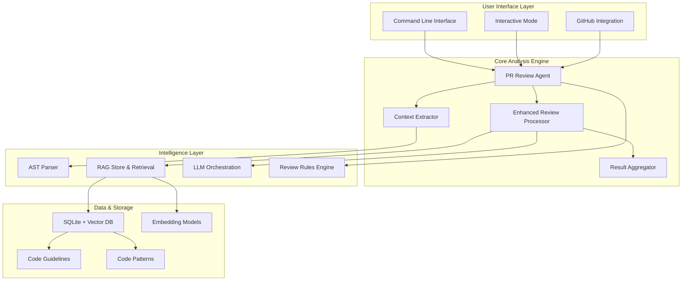

# Maestro - Advanced AI-Powered Code Review Assistant

Maestro is an intelligent code review assistant built with DSPy-Go that provides comprehensive, file-level code analysis for GitHub pull requests. It combines advanced AST parsing, semantic analysis, and LLM-powered reasoning to deliver high-quality, actionable code review feedback.


## 🏗️ Architecture Overview



## 🎯 Core Features

### **Advanced Context Analysis**
- **AST-Based Parsing**: Deep Go code structure analysis including packages, imports, types, and functions
- **File-Level Context**: Comprehensive understanding of code relationships and dependencies  
- **Semantic Purpose Detection**: Automatic identification of code chunk functionality
- **Enhanced Chunk Metadata**: Rich context with 15+ lines of surrounding code

### **Intelligent Review Pipeline**
- **Multi-Stage Processing**: Context preparation → Analysis → Validation → Aggregation
- **File-Level Aggregation**: Groups related issues by file with intelligent deduplication
- **Advanced Debugging**: Comprehensive logging and performance metrics
- **Configurable Processing**: Environment variables for fine-tuning behavior

### **GitHub Integration**
- **Seamless PR Workflow**: Direct integration with GitHub pull request comments
- **Bulk Processing**: Efficient handling of large PRs with parallel processing
- **Interactive Mode**: Guided setup and configuration
- **Real-time Feedback**: Live processing status and progress indicators

### **Flexible Model Support**
- **Multiple Backends**: Anthropic Claude, Google Gemini, Local models (Ollama, LLaMA.cpp)
- **Unified Embedding**: Consistent vector representations for code and guidelines
- **Performance Optimization**: Intelligent model selection and caching

## 🛠️ Enhanced Technical Capabilities

### **Review Dimensions**
- **Code Defects**: Logic flaws, error handling issues, resource management
- **Security Vulnerabilities**: Injection attacks, insecure data handling, authentication issues
- **Maintainability**: Code organization, documentation, naming conventions, complexity
- **Performance**: Algorithmic efficiency, data structures, resource utilization

### **Advanced Features**
- **Vector-Based Similarity**: SQLite with sqlite-vec for efficient code pattern matching
- **Deduplication Engine**: Levenshtein distance-based issue consolidation
- **Context Extraction**: Go AST parsing with semantic analysis
- **Background Indexing**: Non-blocking repository analysis
- **Parallel Processing**: Concurrent chunk analysis for performance

## 📦 Getting Started

### **Prerequisites**
- Go 1.24.1 or higher  
- SQLite with sqlite-vec extension
- GitHub API access token
- Supported LLM backend (Claude, Gemini, or local model)

### **Installation**

```bash
# Clone the repository
git clone https://github.com/XiaoConstantine/maestro.git
cd maestro

# Install dependencies
go mod download

# Build the binary
go build -o maestro

# Set up GitHub token
export MAESTRO_GITHUB_TOKEN=your_github_token
```

### **Quick Start**

```bash
# Interactive mode with guided setup
./maestro -i

# Direct CLI usage for a specific PR
./maestro --owner=username --repo=repository --pr=123

# With enhanced debugging
export MAESTRO_LOG_LEVEL=debug
export MAESTRO_RAG_DEBUG_ENABLED=true
./maestro --owner=username --repo=repository --pr=123 --verbose
```

## ⚙️ Configuration

### **Environment Variables**

#### **Core Configuration**
```bash
MAESTRO_GITHUB_TOKEN=your_token          # GitHub API access
MAESTRO_LOG_LEVEL=debug                  # Logging level (debug, info, warn, error)
```

#### **Enhanced Processing (Phase 4.1)**
```bash
# File-level aggregation
MAESTRO_FILE_AGGREGATION_ENABLED=true    # Enable file-level result aggregation
MAESTRO_DEDUPLICATION_THRESHOLD=0.8      # Issue similarity threshold (0.0-1.0)

# AST Context extraction  
MAESTRO_CONTEXT_EXTRACTION_ENABLED=true  # Enable AST-based context extraction
MAESTRO_CHUNK_CONTEXT_LINES=15          # Lines of context around chunks
MAESTRO_ENABLE_SEMANTIC_CONTEXT=true     # Enable semantic purpose detection
MAESTRO_ENABLE_DEPENDENCY_ANALYSIS=true  # Enable dependency tracking

# Advanced debugging
MAESTRO_RAG_DEBUG_ENABLED=true           # RAG retrieval debugging
MAESTRO_LLM_RESPONSE_DEBUG=true          # LLM response debugging  
MAESTRO_SIMILARITY_LOGGING=true          # Similarity score logging
```

#### **Feature Toggles**
```bash
MAESTRO_ENHANCED_REASONING=true          # Enhanced reasoning capabilities
MAESTRO_COMMENT_REFINEMENT=true          # Comment refinement processing
MAESTRO_CONSENSUS_VALIDATION=true        # Consensus validation
```

### **Command Line Options**
- `--github-token`: GitHub personal access token
- `--owner`: Repository owner
- `--repo`: Repository name  
- `--pr`: Pull request number to review
- `--model`: LLM backend selection
- `--index-workers`: Concurrent indexing workers
- `--review-workers`: Concurrent review workers
- `--verbose`: Enable detailed logging
- `-i`: Interactive mode

### **Model Selection**

```bash
# Use local LLaMA.cpp
./maestro --model="llamacpp:" --pr=123

# Use Ollama with specific model
./maestro --model="ollama:codellama" --pr=123

# Use Anthropic Claude
./maestro --model="anthropic:claude-3-sonnet" --api-key=your_key --pr=123

# Use Google Gemini
./maestro --model="google:gemini-pro" --api-key=your_key --pr=123
```

## 📊 Performance & Metrics

### **Current Scale**
- **Codebase**: 19,552+ lines across 27 Go modules
- **Dependencies**: DSPy-Go v0.36.0, SQLite-vec, GitHub API v68
- **Processing**: Handles 300+ chunks per PR with file-level aggregation
- **Performance**: ~500ms average per chunk with parallel processing

### **Recent Improvements**
- **File Aggregation**: 371 chunks → 21 files (proper grouping)
- **Context Enhancement**: 5 → 15+ lines of chunk context
- **Debug Visibility**: Comprehensive RAG and processing metrics
- **Lint Compliance**: Zero golangci-lint issues

## 🔬 Advanced Usage

### **Debug Mode**
```bash
# Full debug mode with all logging enabled
export MAESTRO_LOG_LEVEL=debug
export MAESTRO_RAG_DEBUG_ENABLED=true
export MAESTRO_LLM_RESPONSE_DEBUG=true
export MAESTRO_SIMILARITY_LOGGING=true
export MAESTRO_CONTEXT_EXTRACTION_ENABLED=true

./maestro --owner=user --repo=project --pr=123 --verbose
```

### **Performance Tuning**
```bash
# Optimize for speed
export MAESTRO_CHUNK_CONTEXT_LINES=10
export MAESTRO_DEDUPLICATION_THRESHOLD=0.9

# Optimize for accuracy  
export MAESTRO_CHUNK_CONTEXT_LINES=20
export MAESTRO_DEDUPLICATION_THRESHOLD=0.7
export MAESTRO_ENABLE_DEPENDENCY_ANALYSIS=true
```

## 📄 License

Maestro is released under the MIT License. See the [LICENSE](LICENSE) file for details.

---
